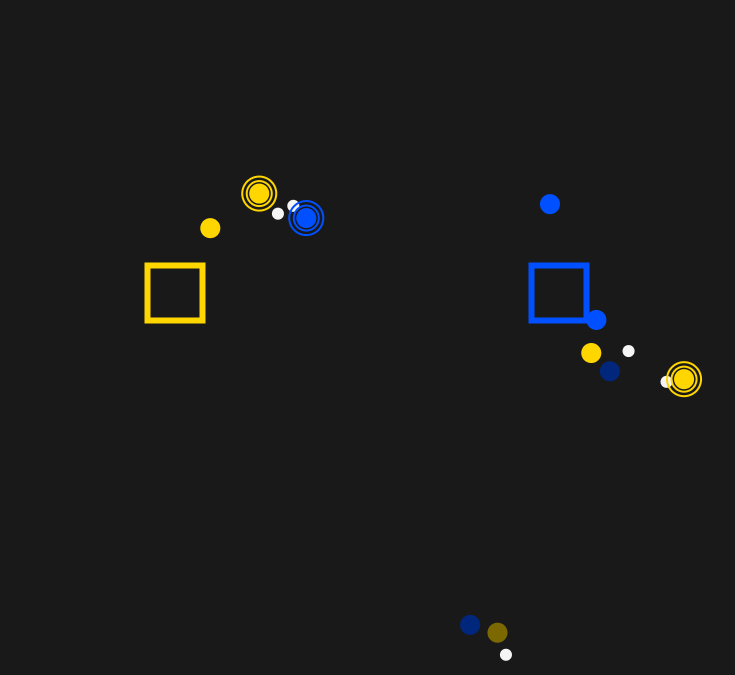

<h1 align=center> Hello there 👋</h1>

<p align=center>
    
    
    
    
    
</p>

## Introduction

Welcome to the Seekers repository! We are a dedicated group of individuals who came together during the prestigious 2022 [LSGM Mathecamp](https://lsgm.uni-leipzig.de/tiki-index.php?page=Mathecamp). Our mission is to enhance, refine, and expand the immersive game called Seekers, designed to teach programming by implementing AI algorithms in Python. If you're interested, we invite you to explore the detailed Game Concept to gain deeper insights.

## About Seekers

Seekers is an interactive game that combines the thrill of gameplay with the educational aspect of programming. By writing Python-based AI algorithms, players can participate in exciting battles and engage in strategic decision-making. The game offers a stimulating environment for honing programming skills, problem-solving abilities, and algorithmic thinking.



## Features

+ Engaging and immersive gameplay experience
+ Educational focus on programming concepts and AI algorithm implementation
+ Python-based AI development
+ Strategic decision-making and problem-solving challenges
+ Continuous updates and improvements by our dedicated team

## Get Started

To begin your journey with Seekers, follow these simple steps:

1. Clone this repository to your local machine using the following command:

```
git clone https://github.com/seekers-dev/seekers-py.git
```

2. Navigate to the project directory:

```
cd seekers-py
```

3. Install the necessary dependencies:

```
pip install -r requirements.txt
```

4. Dive into the game concept by visiting the [Game Concept](https://github.com/seekers-dev/seekers-py/wiki/Game-Concept) page.
5. Explore the codebase, contribute to ongoing development efforts, or create your own AI strategies.

## Contact

If you have any questions, suggestions, or would like to connect with us, you can reach us through the following channel:

+ Discord: [Seekers Official Server](https://discord.gg/gRaTCgDS9b)

We look forward to hearing from you and hope you enjoy your experience with Seekers!